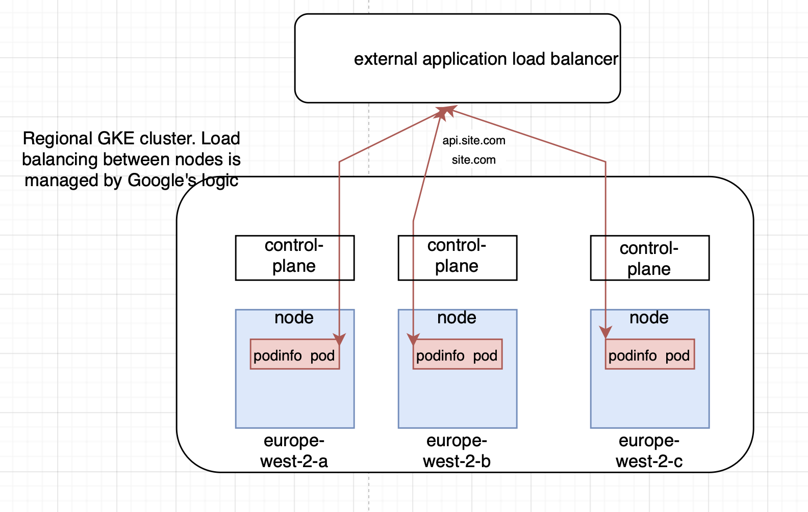

# drktrc 

## 1. Assumptions:
We are using Cloud. As a reference, GCP will be used, but in general - logic would be the same for AWS or similar.
We assume that users are located in the UK, so we will use London region with 3 availability zones for failover. 

### What we need to consider for current task, from client requirements:
- **High-availability:** Region cluster.
- **Security:** RBAC for secrets. https. SOPS+KMS to store secrets in git.
- **Scalability:** HPA implemented. 
- **Maintainability:** Most of configuration is in code, easy to maintain.
- **Monitoring & Observability:** We will leverage Grafana+Prometheus stack.
- **Cost effectiveness:** If we will implement Cluster autoscaling, this will allow us to save a lot when not under high load.

## 2. HLD

### 2.1 Infrastructure
Incoming traffic is routed using alias or A-record to `external application load balancer` IP. Then, depending on path, traffic is routed to the specific backend, api.site.com, auth.site.com, site.com etc. Certificates are provisioned using certmanager, which is described inside .yaml files. 

## 3. ADR

- **GitOps approach:** FLUX+Kustomize+Helm.
  - Secure: You don't need to connect to the cluster from GH Actions.
  - All is in code. [Flux Example](https://github.com/fluxcd/flux2-kustomize-helm-example)

- **Regional GKE cluster:**
  - Better failover: If one zone fails, the other will still be working.
  - GKE spreads control plane across 3 zones.
- **Caching**
  - We will use `Redis` for caching as it is already available in `podinfo`.
- **HPA**
  - We will use prometheus-adapter as it is also tend to be used inside `podinfo` for custom metric, also it can be used instead of metrics-server for CPU/Ram metrics. We will install prometheus operator to scrape metrics (also parametrized in `podinfo`), and prometheus-adapter will make metrics available to metrics.k8s.api. Here we will scale if average CPU usage is higher than 95% and RAM usage is higher than 80%.
- **Security**
- GCP KMS+SOPS is used as additional layer to store secrets at git. 
- RBAC limits access to secrets for specific workloads.
- leverage network policies to specify pods interconections.

## 4. Tooling choise explanation

- **GitOps tools:** Flux and ArgoCd were on the table, both CNCF. Flux was chosen as tool I had more experience with.
- **Helm:** Widespread tool, good integration with Flux, big community, CNCF. Flexible in combination with kustomize.
- **Terraform:** Quite popular tool.
  - **Cons:** It's not fully open-source now, OpenTofu should be considered.
- **Terragrunt:** Easier management of tf code, variables etc.

## 5. Future considerations/improvements (out of 90 min):

- **5.1:** Implement HPA based on custom metrics from podinfo, not basic metrics such as CPU.
- **5.2:** Implement scalable database with readreplicas and multizonal.
- **5.3:** Set up CloudArmor policies for DDOS protection/geoblocking.
- **5.4:** Implement Cluster autoscaling - for really high loads or Cost effectiveness.
- **5.5:** Implement Vault etc - benefits - Key rotation and versioning.
- **5.6:** Modify application to be ready for CSR and implement bucket+google CDN - this will allow faster download and lowers load on our cluster as well frees some cpu/ram resources.
- **5.7:** For higher failover - set-up multi-region deployment. Using our tech stack it's quite easy, just need to create new similar GKE workload in different region and reconfigure global LB. Flux will take care of deployment to all clusters.

